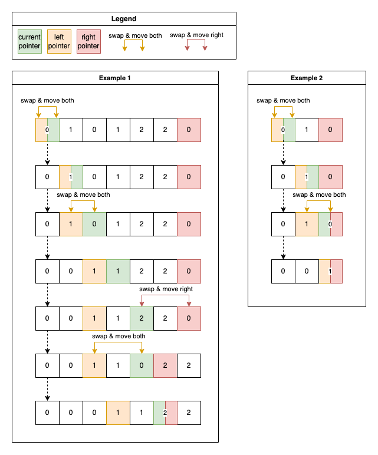
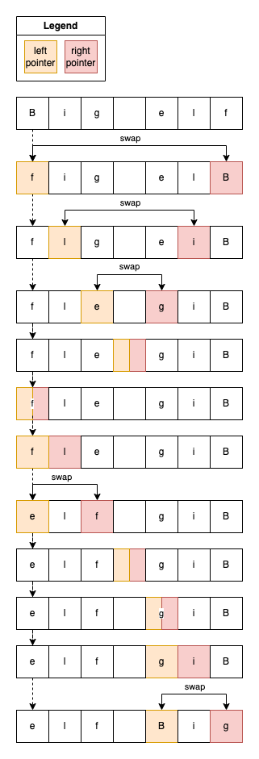
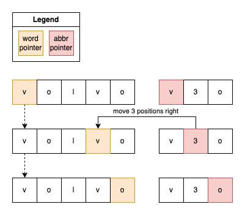
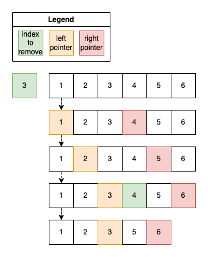

# Grokking algorithms

## Motivation:

Personal sandbox project for studying and practicing algorithms needed for
solving [Leetcode.com](https://leetcode.com) tasks.

## Algorithms

### Two Pointers

The two pointers pattern allows efficiently traverse linear data structures, such as array or
string. Pointers are typically starts from the beginning and from the end and then dynamically
adjust based on some condition or criteria.

#### Arrays:

1. Reversing an array

---

#### Algorithm:

1. Starting from the first and last element
2. Flip elements and move pointers

---

2. Pair with a given sum in the sorted array

---

#### Code example:

[pair with a given sum in a sorted array](src/test/java/arrays/TwoPointersPairSum.java).

#### Algorithm:

1. Starting from the first and last element
2. Compare sum of current elements:
    - if sum more than expected - decrement right pointer index
    - if sum less than expected - increment left pointer index

---

3. Triplet with a given sum

---

#### Code example:

[triplet with a given sum](src/test/java/arrays/TwoPointersTripletSum.java)

#### Algorithm:

1. Sort an array in ascending order
2. Iterating through all elements from the start to the `length - 2`
3. On each iteration:
    1. initialise 2 pointers: start as `i + 1` and end as `lenght - 1`
    2. calculate sum of 3 elements: start, end and current

---

4. Given an array with 3 colors group them by color

---

#### Example:

Colors:

- red - 0
- green - 1
- blue - 2

Input: `[0 1 0 2 1 0 1]`

Output: `[0 0 0 1 1 1 2]`

#### Code example:

[sort colors](src/test/java/arrays/TwoPointersSortColors.java)

#### Algorithm:

1. Initialise 3 pointers:
    - `left`: start of the array, responsible for `0`
    - `current`: start of the array, responsible for `1`
    - `right`: end of the array, responsible for `1`
2. On each step check `current` element:
    - if it is `1` - increment `current` index
    - if it is `0` - swap `current` and `left` and increment **both `current` and `left`**
    - if it is `2` - swap `current` and `right` and decrement **only** `right`
3. Do this until `current` will reach `right`

---

#### Strings:

1. Detecting a valid palindrome

---

#### Code example:

[detecting a palindrome](src/test/java/strings/TwoPointersPalindrome.java).

#### Algorithm:

1. starting from start and end
2. on each steps checking if letters match
3. if pointers reached same index - then string is a palindrome

---

2. Reverse words in the string

---

#### Example:

- Given: `Red Big Elf Hat`
- Expected result: `Hat Elf Big Red`

#### Code example: 
[reverse words](src/test/java/strings/TwoPointersReverseWords.java)

#### Algorithm:

1. Reverse a string using two pointers:
    1. initialise `start` pointer at the start of the string
    2. initialise `end` pointer at the end of the string
    3. swap symbols for `start` and `end` pointers
    4. increment `start` pointer and decrement `end` pointer
2. On the reverses string initialise two pointers both on the start of the string
3. Move `end` pointer until next symbol is space or end of the string
4. Reverse word between `start` and `end` pointers
5. Move both start and end pointers to the index of found space

---

3. Valid abbreviation

---

Valid examples:

- kubernetes -> k8s
- internationalisation -> i18n

Invalid examples:

- car -> c2t
- car -> c0ar
- hat -> 2d

#### Code example:

[Valid palindrome](src/test/java/strings/TwoPointerValidAbbreviation.java)

#### Algorithm:
1. Initialise 2 pointers: first for word and second for abbreviation
2. For each letter of abbreviation:
   - if it is a digit:
     - if it 0 - return false
     - if not 0 - parse number moving abbreviation pointer and increment word pointer on this number
   - if not a digit:
     - if word pointer is out of word length - return false
     - if word letter does not match abbreviation letter - return false
     - if letters match - increment both pointers
3. If abbreviation fully checked and there are no additional letters in word - return true

---

#### Linked lists

1. Remove N-th node from the end of the linked list

---

#### Code example:

[remove n-th node from the end of linked list](src/test/java/linkedlist/TwoPointersRemoveNthsNode.java)

#### Algorithm:

1. Init 2 pointers at the beginning of the list: left and right
2. Move right pointer to `n` positions
3. Move both pointers to till right hits the end of the list
4. Relink `next` element of the left pointer

---

## References:

- [Manning: Grokking algorithms](https://www.manning.com/books/grokking-algorithms)
- [Educative: Grokking the Coding Interview Patterns](https://www.educative.io/courses/grokking-coding-interview)
