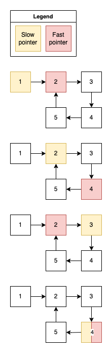

# Grokking algorithms

## Motivation:

Personal sandbox project for studying and practicing algorithms needed for
solving [Leetcode.com](https://leetcode.com) tasks.

## Algorithms

### Two Pointers

The two pointers pattern allows efficiently traverse linear data structures, such as array or
string. Pointers are typically starts from the beginning and from the end and then dynamically
adjust based on some condition or criteria.

#### Arrays:

1. Reversing an array

---

#### Algorithm:

1. Starting from the first and last element
2. Flip elements and move pointers

---

2. Pair with a given sum in the sorted array

---

#### Code example:

[pair with a given sum in a sorted array](src/test/java/arrays/twopointers/TwoPointersPairSum.java).

#### Algorithm:

1. Starting from the first and last element
2. Compare sum of current elements:
    - if sum more than expected - decrement right pointer index
    - if sum less than expected - increment left pointer index

---

3. Triplet with a given sum

---

#### Code example:

[triplet with a given sum](src/test/java/arrays/twopointers/TwoPointersTripletSum.java)

#### Algorithm:

1. Sort an array in ascending order
2. Iterating through all elements from the start to the `length - 2`
3. On each iteration:
    1. initialise 2 pointers: start as `i + 1` and end as `lenght - 1`
    2. calculate sum of 3 elements: start, end and current

---

4. Given an array with 3 colors group them by color

---

#### Example:

Colors:

- red - 0
- green - 1
- blue - 2

Input: `[0 1 0 2 1 0 1]`

Output: `[0 0 0 1 1 1 2]`

#### Code example:

[sort colors](src/test/java/arrays/twopointers/TwoPointersSortColors.java)

#### Algorithm:

1. Initialise 3 pointers:
    - `left`: start of the array, responsible for `0`
    - `current`: start of the array, responsible for `1`
    - `right`: end of the array, responsible for `1`
2. On each step check `current` element:
    - if it is `1` - increment `current` index
    - if it is `0` - swap `current` and `left` and increment **both `current` and `left`**
    - if it is `2` - swap `current` and `right` and decrement **only** `right`
3. Do this until `current` will reach `right`

---

#### Strings and Numbers:

1. Detecting a valid palindrome

---

#### Code example:

[detecting a palindrome](src/test/java/strings/twopointers/TwoPointersPalindrome.java).

#### Algorithm:

1. starting from start and end
2. on each steps checking if letters match
3. if pointers reached same index - then string is a palindrome

---

2. Reverse words in the string

---

#### Example:

- Given: `Red Big Elf Hat`
- Expected result: `Hat Elf Big Red`

#### Code example:

[reverse words](src/test/java/strings/twopointers/TwoPointersReverseWords.java)

#### Algorithm:

1. Reverse a string using two pointers:
    1. initialise `start` pointer at the start of the string
    2. initialise `end` pointer at the end of the string
    3. swap symbols for `start` and `end` pointers
    4. increment `start` pointer and decrement `end` pointer
2. On the reverses string initialise two pointers both on the start of the string
3. Move `end` pointer until next symbol is space or end of the string
4. Reverse word between `start` and `end` pointers
5. Move both start and end pointers to the index of found space

---

3. Valid abbreviation

---

Valid examples:

- kubernetes -> k8s
- internationalisation -> i18n

Invalid examples:

- car -> c2t
- car -> c0ar
- hat -> 2d

#### Code example:

[Valid palindrome](src/test/java/strings/twopointers/TwoPointerValidAbbreviation.java)

#### Algorithm:

1. Initialise 2 pointers: first for word and second for abbreviation
2. For each letter of abbreviation:
    - if it is a digit:
        - if it 0 - return false
        - if not 0 - parse number moving abbreviation pointer and increment word pointer on this
          number
    - if not a digit:
        - if word pointer is out of word length - return false
        - if word letter does not match abbreviation letter - return false
        - if letters match - increment both pointers
3. If abbreviation fully checked and there are no additional letters in word - return true

---

4. Strobogrammatic number

---

[Strobogrammatic number](https://en.wikipedia.org/wiki/Strobogrammatic_number) - is a number, that
reads the same rotated 180 degrees.

Valid examples:

- 101
- 609
  Invalid examples:
- 1010
- 828

#### Code example:

[Strobogrammatic number](src/test/java/strings/twopointers/TwoPointersStrobogrammaticNumber.java)

#### Algorithm:

1. Initialise 2 pointers: first at the beginning of the number and second at the end
2. For the beginning digit find corresponding strobogrammatic digit
3. If strobogrammatic digit not match digit at the end - return false
4. Otherwise increment start pointer and decrement end pointer
5. If pointers met - number is strobogrammatic

---

5. Number of moves to make a palindrome

---

Example: `aabb -> abab -> abba`

#### Code example:

[Number of moves to make a palindrome](src/test/java/strings/twopointers/TwoPointersNumOfMovesToMakePalindrome.java)

#### Algorithm:

1. Initialise 2 pointers: `left` at start and at `right` the end of the string
2. If `left` and `right` letters are not the same:
    - Move `right` pointer till it bigger the `left` and letter is not equal to `left` letter
    - if found:
        - move `right` pointer back swapping letters and incrementing number of moves
        - increment `left` pointer and decrement `right` pointer
    - if not found for the first time:
        - move `left` pointer to the middle swapping letters, so `left` letter is in the middle
        - set `left` and `right` pointer back to their positions
    - if not found for the second time - it is not possible to make a palindrome
3. Continue till pointer meet

---

6. Find next greater palindrome number

---

Example:

- 1221 - 2112
- 14322341 - 21344312
- 131 - null

#### Code example:

[Find next greater palindrome number.java](src/test/java/strings/twopointers/TwoPointersNextGreaterPalindrome.java)

#### Algorithm:

1. Split palindrome into 2 halves, in case of odd number of letters - store middle one separately
2. start iterating from the end of the left half
3. find **digit to replace**: the one, that is less than next one, e.g.: `[3]4`, `[1]3`, etc.
4. restart iteration from the end of the left half
5. find **replacement digit**: the one, that is bigger than **digit to replace**
6. swap **digit to replace** with **replacement digit**
7. reverse all the digits to the right of the swapped position
8. mirror left half and add middle digit if required to return the answer

---

7. Check if palindrome is valid after removing only one letter

---

#### Example:

- `abbac` - valid
- `cabba` - valid
- `abbcac` - not valid

#### Code example:

[Check if palindrome is valid after removing only one letter](src/test/java/strings/twopointers/TwoPointersValidPalindromeRemovingSingleLetter.java)

#### Algorithm:

1. initialise 2 pointers: `left` at the start of the string and `right` at the end
2. move pointers until letters are match or pointers are meet
3. once letters not match:
    1. increment mismatch counter, if it is more than 1 - return `false`
    2. check letter at the `right - 1` position, if it matches `left` letter - continue
    3. check letter at the `left + 1` position, if it matches `right` letter - continue
    4. if both `right - 1` and `left + 1` are mismatches - return `false`

---

#### Linked lists

1. Remove N-th node from the end of the linked list

---

#### Code example:

[TwoPointersRemoveNthsNode.java](src/test/java/linkedlist/twopointers/TwoPointersRemoveNthsNode.java)

#### Algorithm:

1. Init 2 pointers at the beginning of the list: left and right
2. Move right pointer to `n` positions
3. Move both pointers to till right hits the end of the list
4. Relink `next` element of the left pointer

---

#### Trees

1. Find lowest common ancestor

---

#### Example:

Given 2 nodes of the tree find lowest common ancestor:

#### Code example:

[Lowest common ancestor](src/test/java/tree/LowestCommonAncestor.java)

#### Algorithm:

1. Initialise two pointers: one on the first and another on second
2. Move both pointers one step up
3. If pointers meet - return the node
4. If pointer reached root - move it to the starting position of the other node

---

### Fast and Slow pointers

This pattern is applicable for iterable data structures, such as linked lists or arrays. It is based
on two pointers, but the second pointer moves faster than the first one.

Often this pattern is used to

- identify patterns
- detect cycles
- find specific elements

Examples of tasks:

- detect a cycle in linked list
- find a middle of the linked list

#### Numbers

1. Check if number is happy

---

#### Description

Number is happy when repeatedly summing squares of it's numbers results in 1 and not happy if there
is a cycle.

Happy number

- [23] -> `2^2 + 3^2=[13]` -> `1^2 + 3^2 = [10]` -> `1^2 + 0^2 = [1]` - true

Not happy number:

- 2 -> [4] -> 16 -> 37 -> 58 -> 89 -> 145 -> 42 -> 20 -> [4]

#### Code example:

[Is happy number](src/test/java/numbers/fastslowpointers/IsHappyNumber.java)

#### Algorithm:

1. Initialise slow pointer as number
2. Initialise fast pointer as number after initial one
3. Until fast pointer is eq to 1 or fast and slow pointers are equal:
    - replace slow pointer with sum of its squares
    - replace fast pointer summing its squares two times
4. If fast pointer is 1 - number is happy

---

#### Linked list

1. Detect cycle in the linked list

---

#### Code example:

[Detect cycle in the linked list](src/test/java/linkedlist/fastslowpointers/DetectCycleInLinkedList.java)

#### Algorithm:

1. Initialise 2 pointers: at fist and at next elements
2. Until fast reaches null or slow equal to the fast:
    - move slow pointer one step forward
    - move fast pointer two steps forward
3. If fast pointer is null - return false

---

2. Find middle of the linked list

---

#### Code example:

[FindMiddleOfLinkedList.java](src/test/java/linkedlist/fastslowpointers/FindMiddleOfLinkedList.java)

#### Algorithm:

1. Init slow and fast pointer at the head of linked list
2. While fast and fast.next are not null:
    - move slow pointer 1 step forward
    - move fast pointer 1 step forward, null check, 1 step forward
3. Slow pointer will be referencing middle of the list - return it

---

## References:

- [Manning: Grokking algorithms](https://www.manning.com/books/grokking-algorithms)
- [Educative: Grokking the Coding Interview Patterns](https://www.educative.io/courses/grokking-coding-interview)
